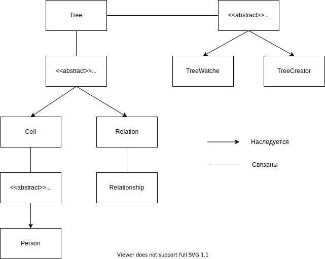

# Геологическое древо
_____
### *Аннотация*
Данное задание было передано с целью практического применения полученных нами знаний в ходе лекций знакомства с ООП
основных концептов стиля классического ООП - инкапсуляции, наследования, полиморфизма, а также абстракции.
______

### <ins>Тех. задание:</ins>
Реализовать, с учетом ооп подхода, приложение для проведения исследований с генеалогическим древом.      
Идея: описать некоторое количество компонент, например: модель человека компонента хранения связей и отношений 
между людьми: родитель, ребёнок - классика, но можно подумать и про отношение, брат, свекровь, сестра и т. д.
компонент для проведения исследований дополнительные компоненты, например отвечающие за вывод данных в консоль, 
загрузку и сохранения в файл, получение\построение отдельных моделей человека. Под “проведением исследования” 
можно понимать получение всех детей выбранного человека.    
Также, необходимо добавить элементы абстракции. т. е. на этом дз нужно гарантированно продумать иерархию компонент
и взаимодействия их между собой. Обеспечить переход от использования явных классов в сторону использования
абстрактных типов. Т. е. работаем не с: конкретным экземпляром генеалогического древа, а с 
интерфейсом “генеалогическое древо”.
 
 
#### *Краткое описание решения*
Для решения была взята концепция объекта - дерева и субъекта - программы, которое может выполнять над деревом 
необходимые операции. Само дерево - есть набор базовых единиц объектов дерева, которые собираются в одну общую
структуру. Эти структуры имеют индексы, по которым соединяются между собой. Сами единицы - это ячейки - 
сам объект сравнивания и связи - объект результата взаимоотношения двух объектов. Так как, каждый объект имеет 
свой адрес, то все объекты мы можем хранить в линейной структуре, просто обращаться к ней по адресу, указанной 
в объекте. Далее для изучения дерева, созданы модули по его построению и просмотру.

 

#### Визуальное построение объектов

 

